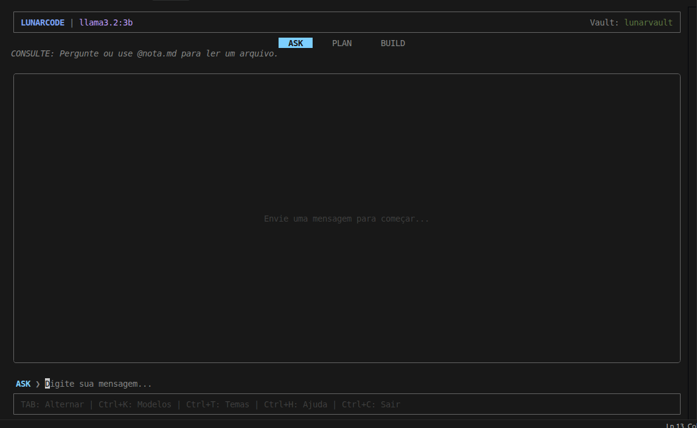

# 🌙 LunarCode v0.2.0

O LunarCode é um agente CLI movido a IA criado para transformar suas notas em Markdown (vaults do Obsidian) em uma base de conhecimento inteligente e interativa, usando o **Ollama** localmente.

Diretamente do seu terminal, você pode conversar com seu vault, planejar projetos e criar conteúdo — tudo processado 100% localmente para manter sua privacidade absoluta.

[](./LICENSE)
[](https://nodejs.org/)
[](https://ollama.com/)

---

## 🚀 Novas Funcionalidades (v0.2.0)

- **🧠 Memória Semântica (RAG)**: Use o comando `lunarcode index` para criar um índice vetorial do seu vault. O agente agora realiza buscas semânticas profundas para encontrar informações mesmo sem menção direta.
- **💬 Histórico Conversacional**: O LUNAR agora tem memória de curto prazo. Ele entende perguntas de seguimento como "especifique mais" ou "quem citou isso?".
- **🔗 Deep Context Crawling**: Ao mencionar uma nota com `@`, o agente também analisa automaticamente links internos (`[[WikiLinks]]`) para expandir o contexto de resposta.
- **🏗️ Automação de Arquivos (Modo BUILD)**: Crie e edite notas via IA com segurança. O agente utiliza uma estrutura JSON para garantir que as alterações no disco sejam precisas e profissionais.
- **📺 Interface TUI Estabilizada**: Interface redesenhada para maior estabilidade, suporte a scroll de mensagens longas e layout horizontal ultra-eficiente.

---

## ✨ Modos de Operação

- **`ASK`**: Consulte seu conhecimento. 
  - *Dica:* Use `@nota.md` para dar foco total a um arquivo.
- **`PLAN`**: Ideal para brainstorming, estruturação de projetos e criação de sumários.
- **`BUILD`**: O modo de escrita. Peça para "criar uma nota sobre..." ou "melhorar o conteúdo da nota @estudo.md".

---

## 🛠️ Início Rápido

### Pré-requisitos

1.  **Instalar o [Ollama](https://ollama.com/)**:
    - **Linux**: `curl -fsSL https://ollama.com/install.sh | sh`
    - **macOS/Windows**: Download direto pelo site.
2.  **Preparar o Modelo**:
    ```bash
    ollama pull llama3.2
    ```

### Instalação

```bash
git clone https://github.com/seu-usuario/lunarcode.git
cd lunarcode
npm install
npm run build
npm link
```

### Fluxo de Trabalho

1. **Setup**: No seu vault, rode `lunarcode init`.
2. **Indexar**: Rode `lunarcode index` para habilitar a busca inteligente.
3. **Conversar**: Rode `lunarcode open` e comece a perguntar!

---

## 🗺️ Roadmap (O que precisa melhorar)

### UI/UX
- [ ] **Sintaxe de Código**: Markdown highlighting real dentro do chat.
- [ ] **Temas Customizáveis**: Suporte para carregar esquemas .json de cores.
- [ ] **Feedback Progressivo**: Melhores indicadores para operações longas da IA.

### Features
- [ ] **Suporte Multi-Line**: Input de terminal para múltiplos parágrafos.
- [ ] **Agentes Especialistas**: Personas customizadas para diferentes tipos de uso.
- [ ] **Exportação**: Salvar conversas do chat como notas `.md`.
- [ ] **Multi-Vault**: Alternar vaults em tempo de execução.

---

## 📄 Licença

Este software possui uma **Licença Personalizada Restritiva**. É permitido o uso pessoal e contribuições para o código-fonte, mas a redistribuição comercial ou desenvolvimento de produtos derivados concorrentes é proibida. Veja o arquivo [LICENSE](./LICENSE) para detalhes completos.

---